---
sidebar_position: 1            
--- 

# Access Point           
## What is an Access Point  
An Access Point (AP) is a networking hardware device that allows a Wi-Fi-enabled device to connect to a wired network. It acts as a bridge between wireless clients and a wired local area network (LAN), facilitating communication between devices within the network.

## Why do we need an Access Point   
An access point is essential for creating a wireless network, providing connectivity for devices such as laptops, smartphones, and other Wi-Fi-enabled devices. They enable seamless access to wired networks, which allows users to connect and communicate without the need for physical cables.

## How to create an Access Point  
```
Before creating a new access, the MAC address is to be created using the access point, the MAC address is deleted and checked.
This process is called Detection Access Point.

```
1. Click on the **Access Point** menu located on the left side.

   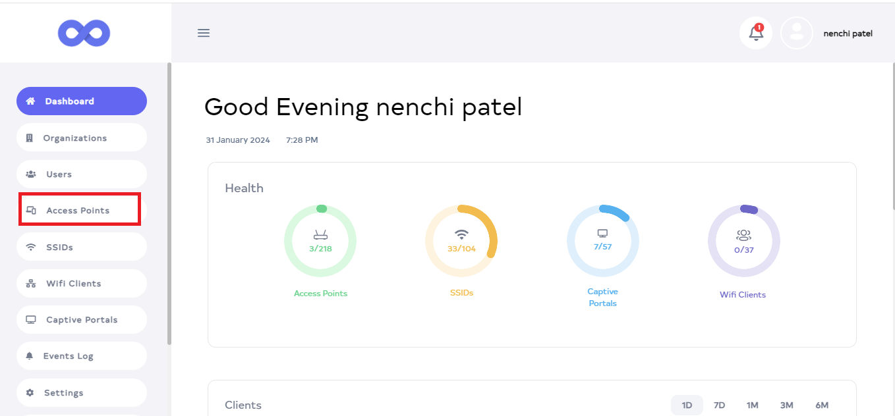
2. You will click **Access Point**, and there you will see a list of **Access Point Devices**.

   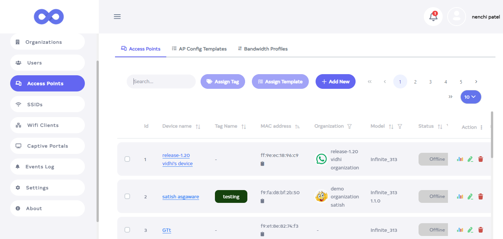

3. Go to the Search tab. After going to the search tab enter **MAC address** (enter **MAC address** which you registered and want to create a new one using the same MAC address)

   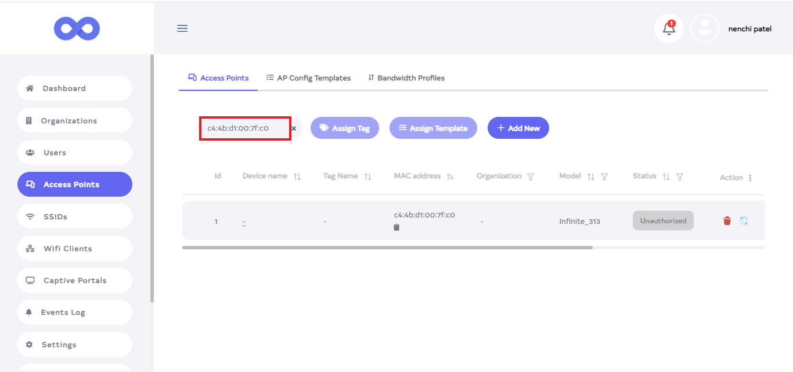

4. After that the **MAC Address** which was searched is found.

   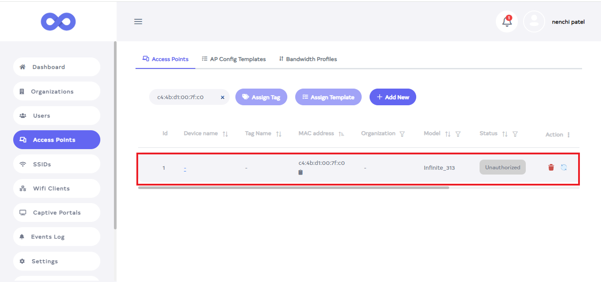

```
- Before creating a new Access Point, first Register the MAC address that you want to use to create an AP(Access Point)

```

1. Click on the **Add New** button. 

   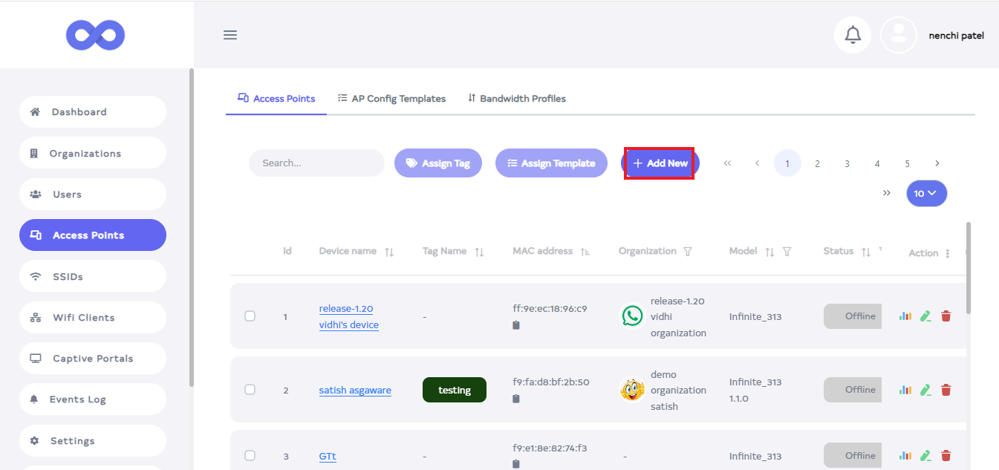

2. After clicking the **Add New** button, a new window will appear.

   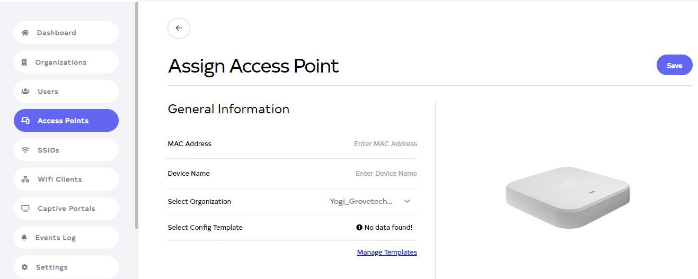

3. Fill in your details.            
   **1. MAC Address**: Enter your **MAC Address** for **Ex: da:09:48:ba:c5:e6**.        
   **2. Device Name**: Enter your **Device Name** for **Ex: Document**.           
   **3. Select Organization**: Choose your organization.       

   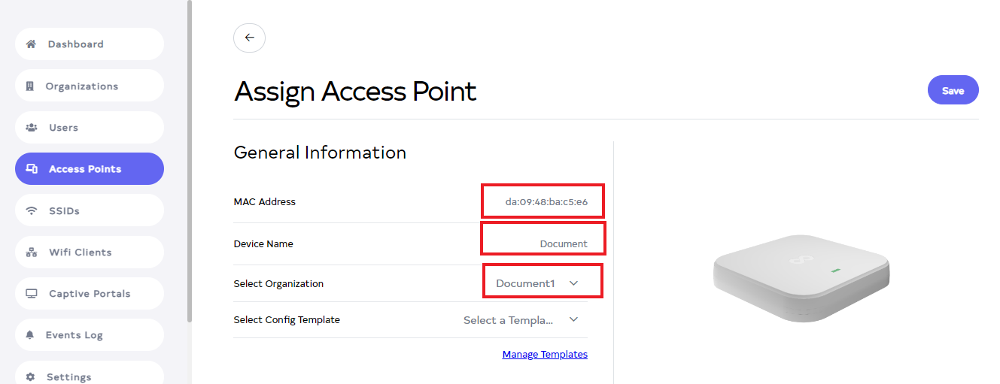

4. Then click on the located right side **Save** button.

   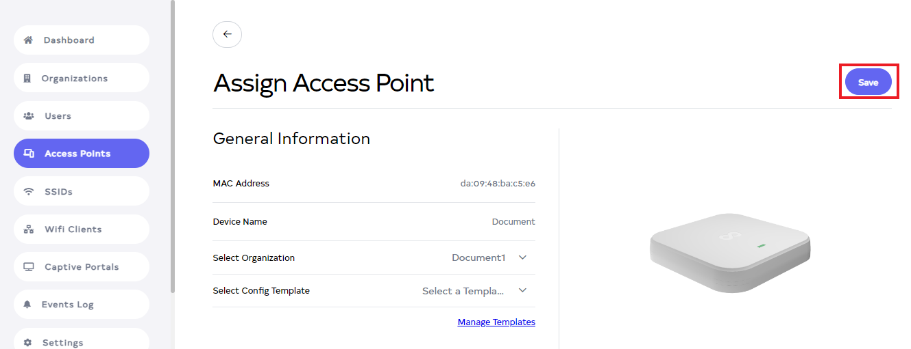

5. As soon as you click on the **Save** button, you will get a message on the screen that the **Device is assigned successfully**.

   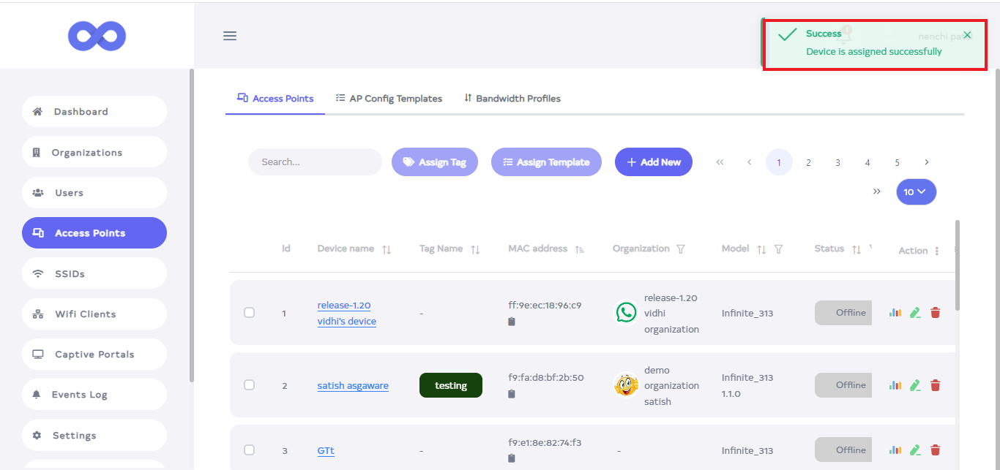

6.  Go to the **Search** tab and **Search** your Device name or **MAC Address**. After that, you will enter, and there you will find your device.

    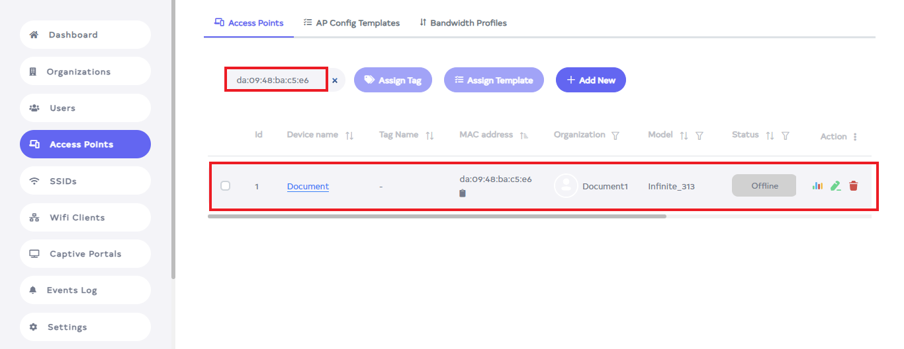

## How to edit Access Point  
1. Go to the **Acess point** want to edit.
2. Click on the Edit located on the right side of your **access point**.

   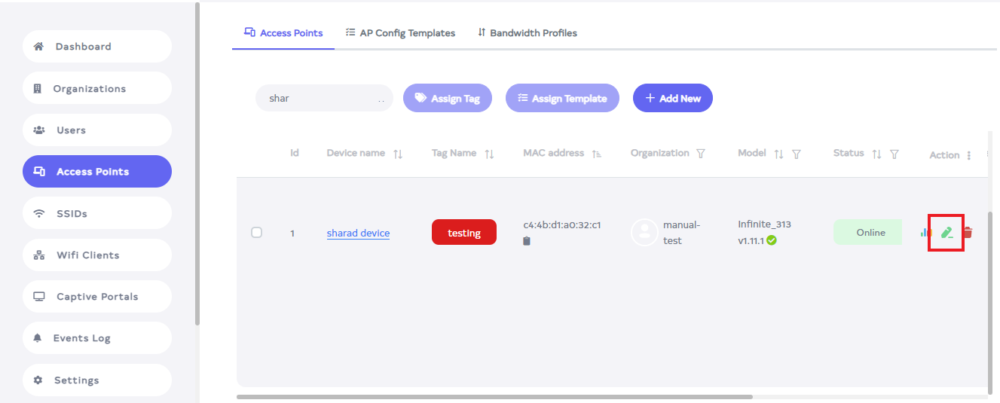

3. After clicking, a new window will open.

   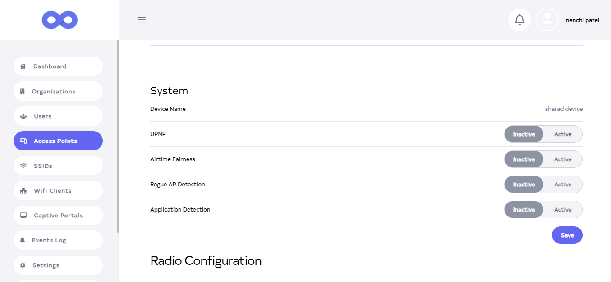

4. From here you can make changes. From there you can access the **System, Radio Configuration, Commands,
Logging, SNMP, Port Forwarding, Firmware, and Firmware can change the schedule**. 

1. Then click on the **Save** button.

    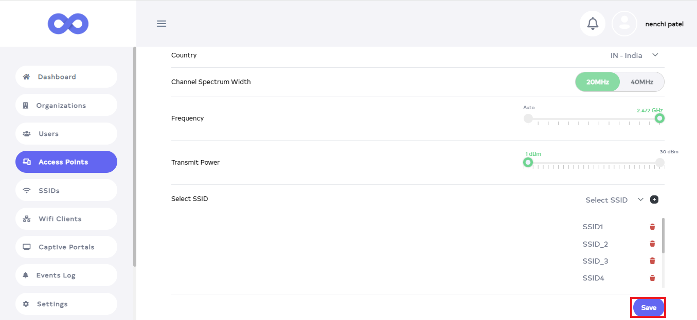

2. After Clicking the **Save** button, you will get a message on the screen that **Device Configuration is updated successfully**.

    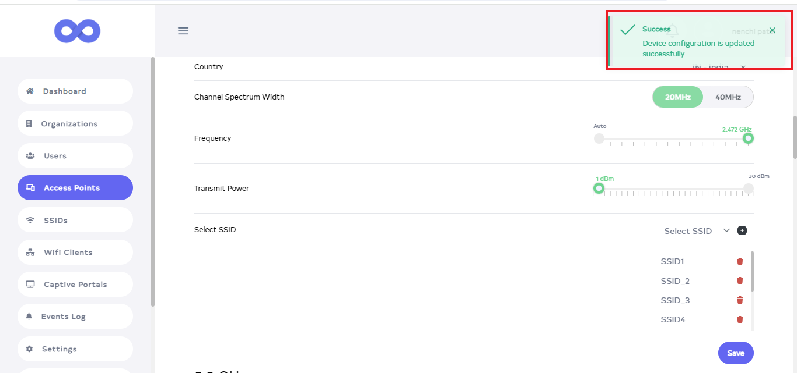
 

## How to delete Access Point  

1. Click on the **delete** located on the right side.

   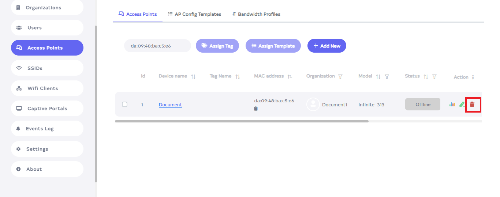

2. After click, a new window will open. There you will get a confirmation message. Click on the Delete button. 

   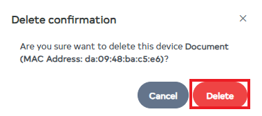

3. As soon as you click on Delete, you will get a message on the screen that the **Device is deleted successfully**.  

   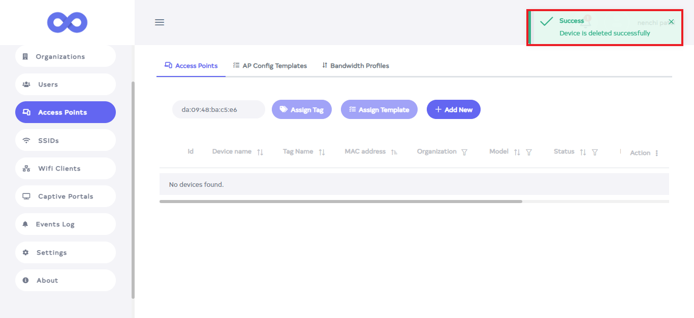   


   
