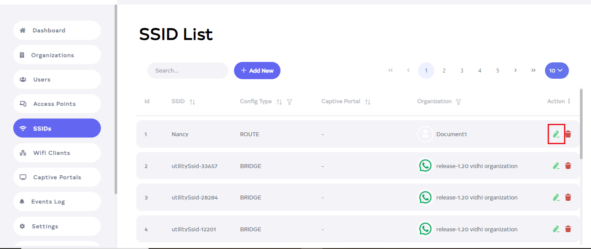
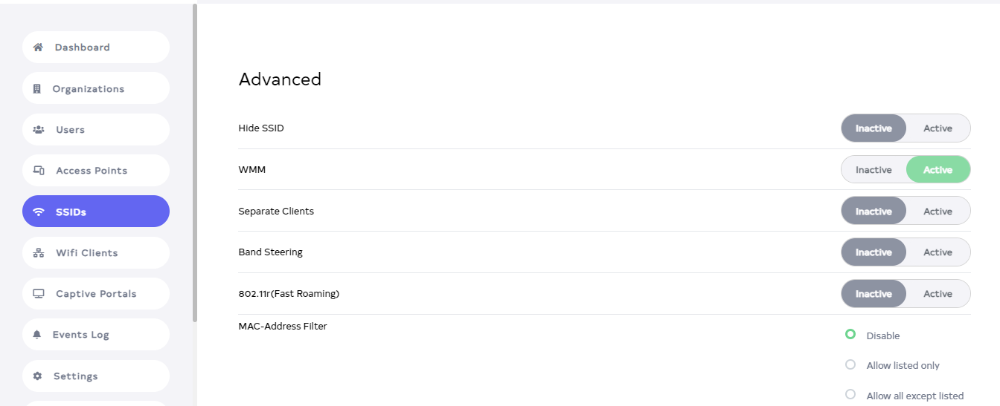

# Advanced
## What is an Advanced
Advanced settings typically encompass additional configurations beyond the basic setup. It may involve fine-tuning parameters related to the **SSIDs** menu, like hiding the SSID, enabling features such as band steering, or adjusting security measures like MAC address filtering. These settings provide more control, customization, and optimization options for wireless networks.                     

**Hide SSID**: This feature allows users to hide the network's SSID (Service Set Identifier), making it invisible to devices scanning for Wi-Fi networks. While it doesn't provide robust security on its own, it can help deter casual users from attempting to connect to the network.    

**WMM (Wi-Fi Multimedia**): WMM is a Wi-Fi Alliance certification that prioritizes network traffic based on application type, ensuring that time-sensitive data such as video and voice receive higher priority for smoother performance.   

**Separate Clients**: This feature allows users to isolate devices connected to the same Wi-Fi network, preventing them from communicating with each other. This can be useful for security purposes or to prevent certain devices from accessing others on the network.   

**Band Steering**: Band steering is a technique used by dual-band routers to optimize network performance by automatically directing devices to the less congested 5GHz band instead of the more crowded 2.4GHz band.   

**802.11r (Fast Roaming)**: 802.11r is a standard for fast roaming in Wi-Fi networks. It enables seamless and uninterrupted roaming between access points, ideal for applications that require continuous connectivity such as VoIP (Voice over Internet Protocol) calls.  

**MAC Address Filter**: MAC (Media Access Control) address filtering allows users to control which devices can connect to the network based on their unique MAC addresses. This feature can be configured to allow or deny access to specific devices, providing an additional layer of security.      
- **Disable**: In this mode, MAC Address Filtering is turned off entirely. All devices, regardless of their MAC addresses, are allowed to connect to the network without any restrictions. This is the least restrictive mode and offers no additional security based on MAC addresses.     

- **Allow listed only**: In this mode, the network administrator creates a list of specific MAC addresses (commonly referred to as a whitelist) of devices that are allowed to connect to the network. Any device whose MAC address is not on the list will be denied access. This mode provides a higher level of security by only allowing authorized devices to connect.    

- **Allow all except listed**: In this mode, the network administrator creates a list of MAC addresses (commonly referred to as a blacklist) of devices that are not allowed to connect to the network. All other devices, whose MAC addresses are not on the blacklist, are permitted to connect. This mode is useful for blocking specific devices from accessing the network while allowing all others.    
## Why do we need an Advanced
Advanced Wi-Fi settings are essential for network administrators and power users who require more control, customization, and optimization options for their wireless networks. These settings can help enhance security, improve performance, and tailor the network to specific requirements and preferences.

## How to configure an Advanced
1. Go to **SSIDs** menu. After going to **SSIDs** menu click on the edit button of **SSID**.

   

2. After clicking on the **edit** button a new window will open. After that, scroll down a bit, and you will see **Advanced**.

   

3. From there you can enable and disable **Hide SSID, WMM, Separate Clients, Band steering, 802.11r (Fast Roaming)** change. and You can disable **MAC Address Filter, allow listed only, and Allow all except listed**.

   

4. Then click on the **Update** button.

   

5. After Clicking the **Update** button, you will get a message on the screen that **SSID details are updated successfully**.

   

