# Bandwidth

## What is a Bandwidth Limit
A bandwidth limit refers to the maximum rate of data transfer across a network connection within a specific timeframe. It is often measured in bits per second (bps), kilobits per second (kbps), megabits per second (Mbps), or gigabits per second (Gbps). Bandwidth limits can be imposed by internet service providers (ISPs), network administrators, or the capabilities of the network hardware itself.

## Why do we need Bandwidth Limit
Bandwidth limits are crucial to effectively manage Internet speeds, ensure fair access for all users, and prevent any single user from monopolizing the available bandwidth. By setting bandwidth limits, administrators can control the speed of data transmission, and have flexibility. for **Ex:-** if the ISP is 200 MB if no limit is given, everything will use net speed. If there is more than one user, bandwidth limitation is used to manage them. Bandwidth limits are useful to prevent speed problems when everyone is using the same network at the same time so that everyone can enjoy and enjoy the same Internet speed.

## How to create Bandwidth Limit
1. Go to **SSIDs** menu. After going to **SSIDs** menu click on the edit button of **SSID**. You can **Access Bandwidth profile** via **Access Point** sub-menu and you can access the **SSID** edit menu. 

   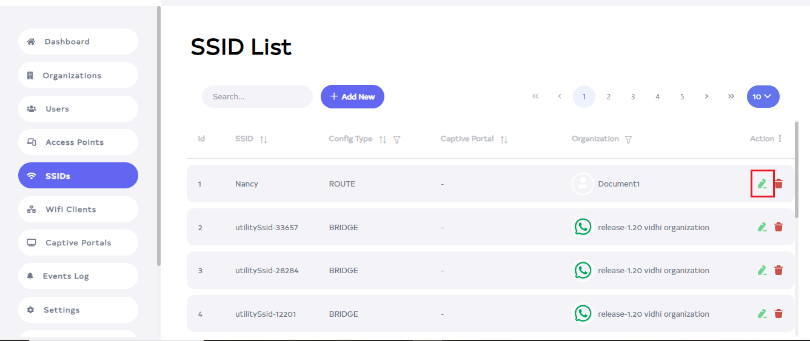

2. After clicking on the **edit** button a new window will open. After that, scroll down a bit, you will see **Bandwidth Limit**, and click on **Manage Profiles**.

   

3. After clicking on **Manage Profiles**. A new window will open. Which by default is opened in the **Bandwidth Profiles** of the access point. There click on **Add New** button.

   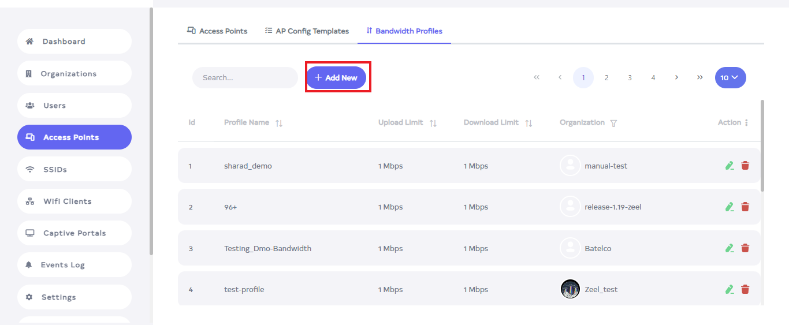

4. Fill in your details.   
   **1. Name**:- Enter your **Name** for **Ex:- nancy-demo**. Type the name you want to create here.       
   **2. Upload**:- Enter **Upload Mbps** for **Ex:- 1Mbps**. By doing this step, the set **Upload Speed** will be available to the user.         
   **3. Download**:- Enter **Download Mbps** for **Ex:- 1Mbps**. By doing this step, the set **Download Speed** will be available to the user.            
   **4. Organization**:- Choose your **organization** for **EX:- Document1**. Organization selection is done because if there is a similar organization, it comes by default. And keep the organization the same. 

   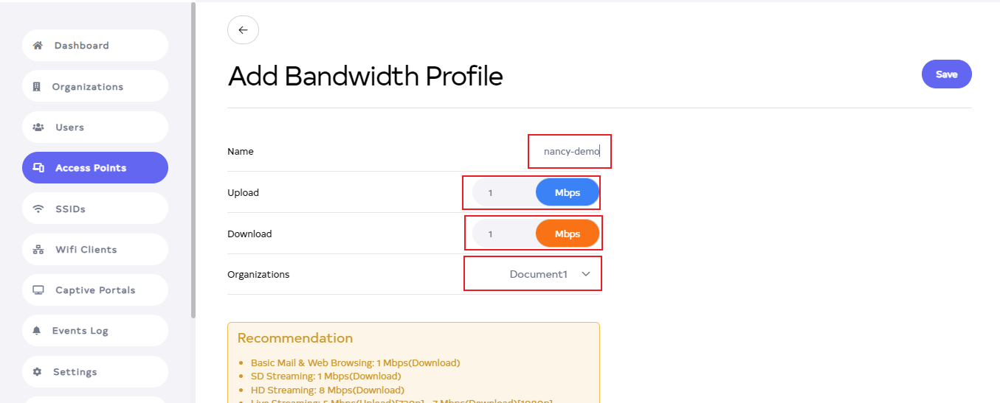

5. Then click on the located right side **Save** button.

   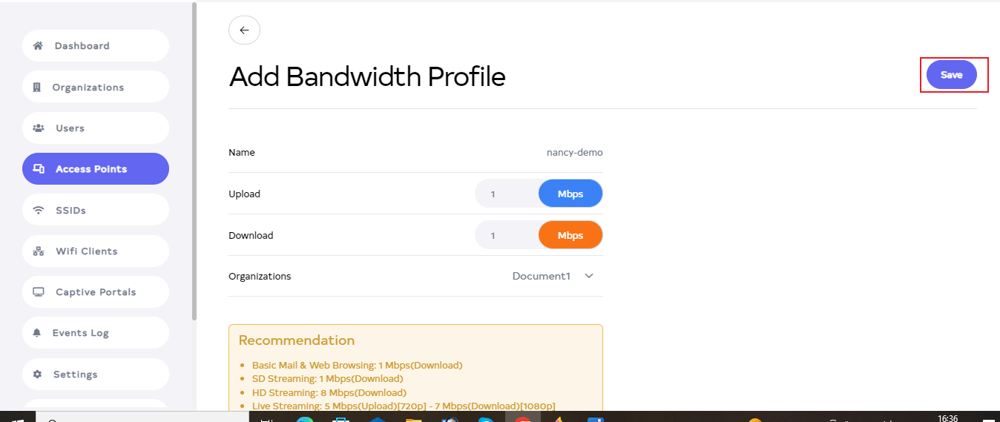

6. As soon as you click on the **Save** button, you will get a message on the screen that **Bandwidth profile is created successfully**.

   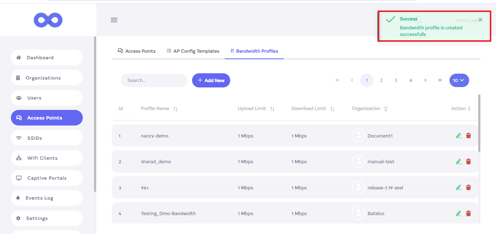

## How to configure Bandwidth Profile
1. Go to **SSID** and then **Bandwidth Limit** go there and click on **Active**.

   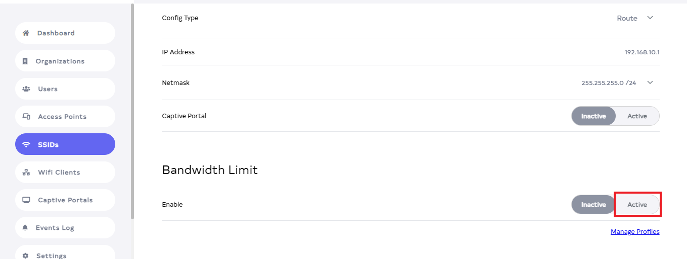

2. Click on active then by default **Bandwidth Profile** will appear.
   ```
   (Note:- Due to having one profile, it comes by default. If there is more than one, you can search and select there.)
   ```
   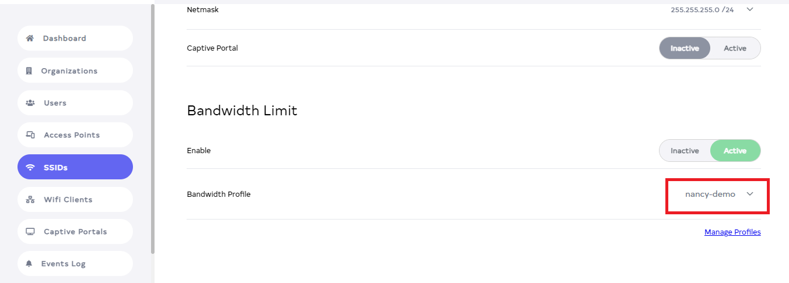

3. Then click on the **Update** button.

   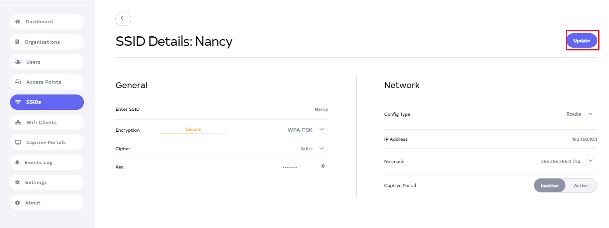

4. After Clicking the **Update** button, you will get a message on the screen that **SSID details are updated successfully**.

   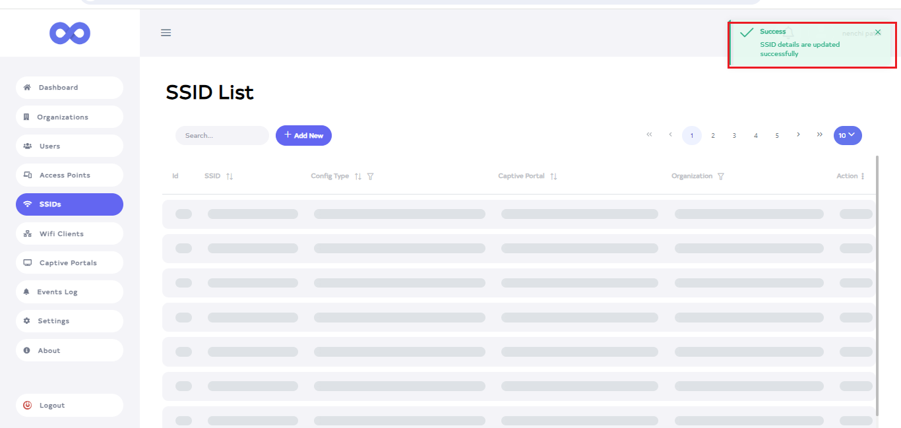

## How to edit Bandwidth Profile
1. Go to an **Access Point** and click on **Bandwidth Profile** in it. 

   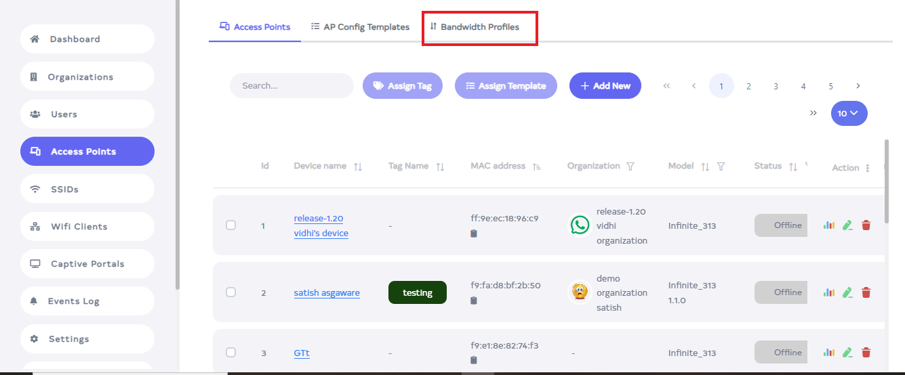

2. Click on it and you will see a summary of the profile. Go to the **Bandwidth Profile** you want to edit.
3. Click on the **Edit** located on the right side of your **Bandwidth Profile**.

   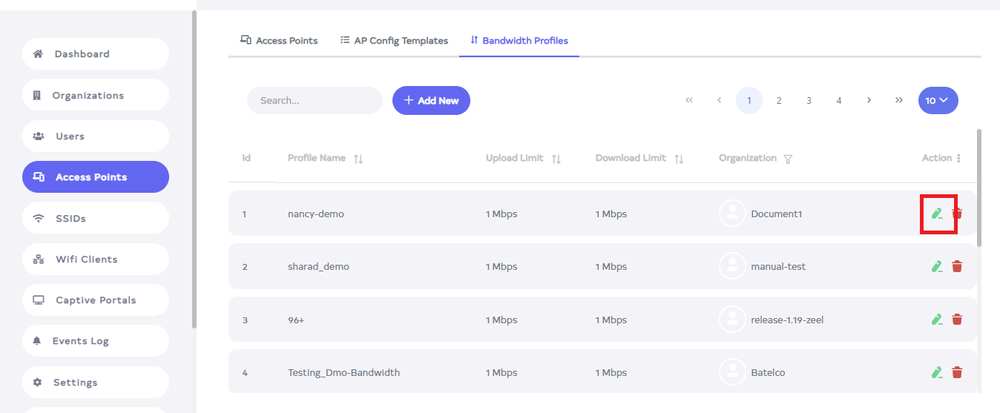

4. From here you can change **Name, Upload Speed, and Download Speed**.

   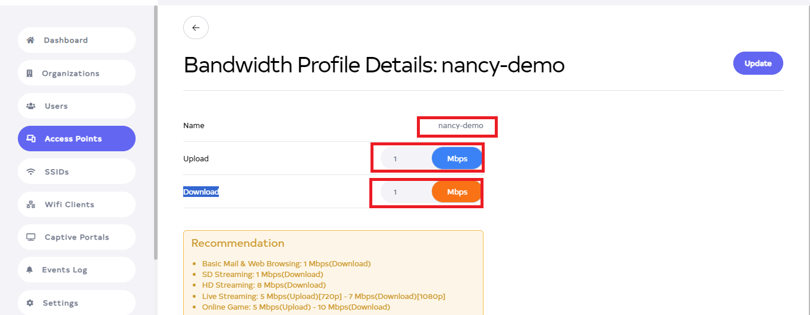

5. Then click on the **Update** button.

   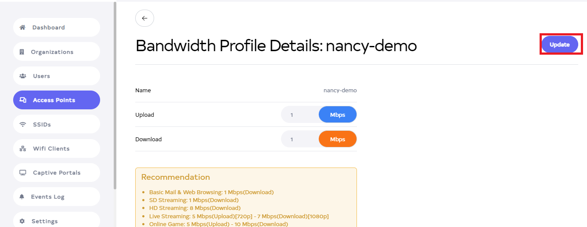

6. After Clicking the **Update** button, you will get a message on the screen that **Bandwidth profile is updated successfully**.

   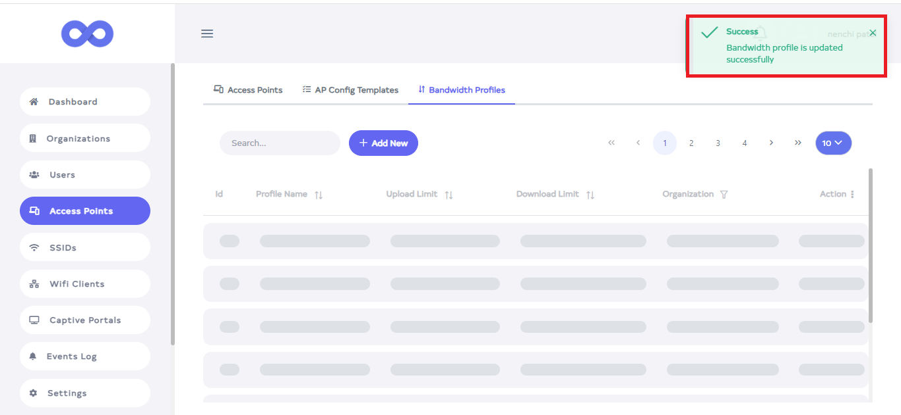

## How to delete Bandwidth Profile
1. Click on the **delete** located on the right side.

   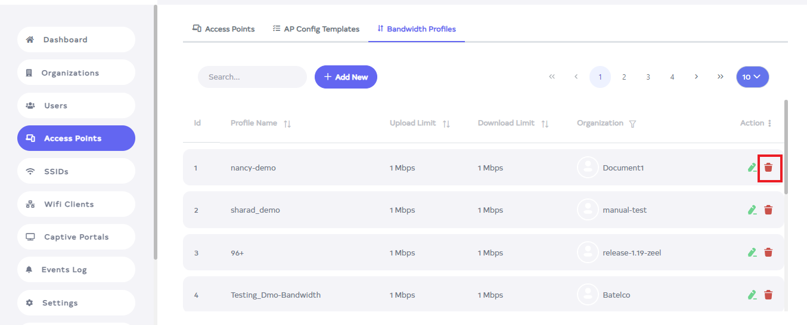

2. After clicking, a new window will open. There you will get a confirmation message. Click on the **Delete** button.

   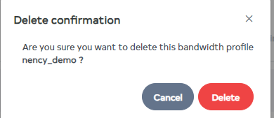

3. As soon as you click on the **Delete** button, you will get a message on the screen that the **Bandwidth profile is deleted successfully**.

   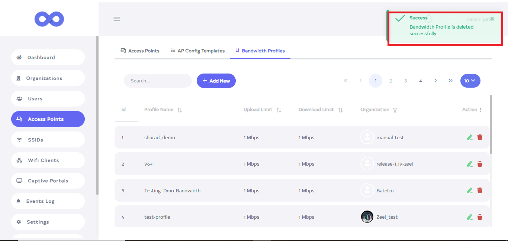
 


   
