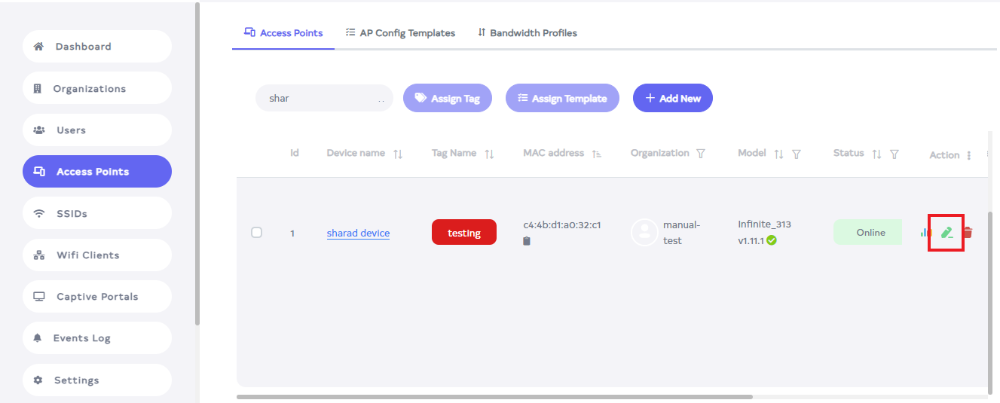
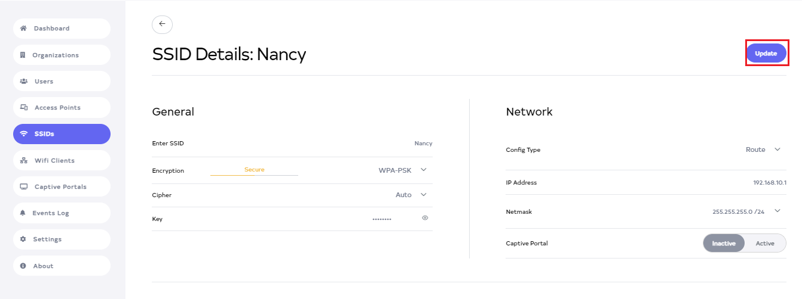

# SSID

## What is SSID
SSID stands for Service Set Identifier, and it refers to the name of a wireless network. In the context of an Access Point (AP), the SSID is a unique identifier that distinguishes one wireless network from another. When you search for available Wi-Fi networks on your device, the list of networks you see is populated by their respective SSIDs.

## Why do we need SSID
SSID is necessary for several reasons:

- **Network Identification**: It helps users identify and connect to the desired wireless network among several available options.          
- **Security**: SSID plays a role in network security. It helps differentiate between secure and open networks, and users can configure their devices to automatically connect to specific SSIDs.             
- **Network Management**: For network administrators, SSID serves as a means to manage and organize different wireless networks within a specific area.   

## How to create SSID
1. Click on the **SSIDs** menu located on the left side.

   

2. You will click on **SSIDs**, and there you will see a list of **SSIDs**. Click on the Add New button.

   

3. After clicking the **Add New** button, a new window will appear.

   

4. Fill in your details.  
   - **General**    
   **1. Select Organization**:- Choose your **organization** for **EX:- Document1**.   
   **2. Enter SSID**:-  Enter your **SSID** for **Ex:- Nancy**.      
   **3. Encryption**:- Select **Encryption** for **Ex:- WPA-PSK**.   
   **4. Cipher**:- Select **Cipher** for **Ex:- Auto**.   
   **5. Key**:- Enter your **Password**.  
   - **Network**  
   **6. Config Type**:- Select **Config Type**. Here **Config Type** is of 2 types (1) Bridge and (2) Route. For **Ex:- select Route**.        
   **7. IP Address and Netmask**:- If we select a route, by default the IP address and Netmask will appear here. ``` note:- one thing to note here is that the IP address should not be the same. The IP of the other SSID and the IP of the created SSID should not be the same. An IP address can be changed if needed. ```      
   
      

5. Then click on the located right side **Save** button.

   

6. As soon as you click on the **Save** button, you will get a message on the screen that **SSID details are added successfully**.

   

## How to connect SSID

1. Go to the **Access Point** and go there and click on the **edit** button of the device.

   

2. After clicking, a new window will open. If you scroll up a little there, the **Radio configuration** will appear.

   

3. Then go to **Select SSID** there. And from there **Select SSID**. After selecting click on the plus icon given on the side.

   

4. Click on the plus icon means that **SSIDs** will be added. But you can select 8 **SSIDs** in it, more than 8 cannot be added.
   ```
   note:-  While creating the SSID, keep in mind that the organization of the device and the organization of the **SSID**
   should be the same, otherwise the **SSID** will not be able to be added.
   ```
   

5. After Clicking the Save button, you will get a message on the screen that **Device Configuration is updated successfully**.

   

## How to disconnect SSID  
1. Go to the **Radio configuration** and after there go to **Select SSID**.

   

2. Then click on **delete** on the **SSID** you want to disconnect. 

   

3. And then click the **Save** button.

   

4. After Clicking the **Save** button, you will get a message on the screen that **Device Configuration is updated successfully**.

   
     
## How to edit SSID

1. Go to the **SSID** want to edit.
2. Click on the Edit located on the right side of your **SSID**.

   

3. After clicking, a new window will open. From here you can change **Enter SSID, Encryption, Cipher, Key, Config Type, IP Address, Netmask, Captive Portal**.

   

4. Then click on the **Update** button.

   

5. After Clicking the **Update** button, you will get a message on the screen that **SSID details are updated successfully**.

   

## How to delete SSID 
1. Click on the **delete** located on the right side.

   

2. After click, a new window will open. There you will get a confirmation message. Click on the Delete button.

   

3. As soon as you click on **Delete**, you will get a message on the screen that **SSID is deleted successfully**.

   

