# Users

## What is User
The user is role into 3 parts.                                                   
**1. Super admin**:- Super Admin user has all access. It is meant to organize and manage. This user has all access.          
**2. Organization user**: The organization user does not have all access, the user can only edit, and cannot create new users.       
**3. User**:- User is divided into two parts **1.Read-only**:- read only the user can view they cannot make any changes to it. **2.Full access**: A full access user is a user who has all access, they can make changes.

## Why type of users are supported
**1. Super Admin**:- This user is assigned extensive access rights which are useful for configuring, managing, and monitoring every aspect of the system. It controls. It can edit users, delete, and also create new users.

**2. Organization User**:- This user does not have access to edit system components, create new users, or delete them. He arranges it in an orderly manner.

**3. User**: The user has two parts. 1 Read only:- A user who gets read-only access is not given modified access. This does not make any changes that the user can see.
2. Full access:- This type of user has all access. It provides control over system functionality.

## Why users are needed
A user is required to configure the platform into specific functions to divide it into its main categories and to grant access to the system. 1. Super Admin user has all access. It is an admin platform that acts like a parent. It can create user edit, delete, and create new users. 2. The organization user works like a network such a user does not have access to create a new user. It can only edit users that other users have created. 3. There are 2 types of normal users. read-only and full access The user who is a read-only user can only see and cannot edit any other user and the full-access user has all access.

## How to Create Organization User
1. Then click on the **User** menu located on the left side. 
   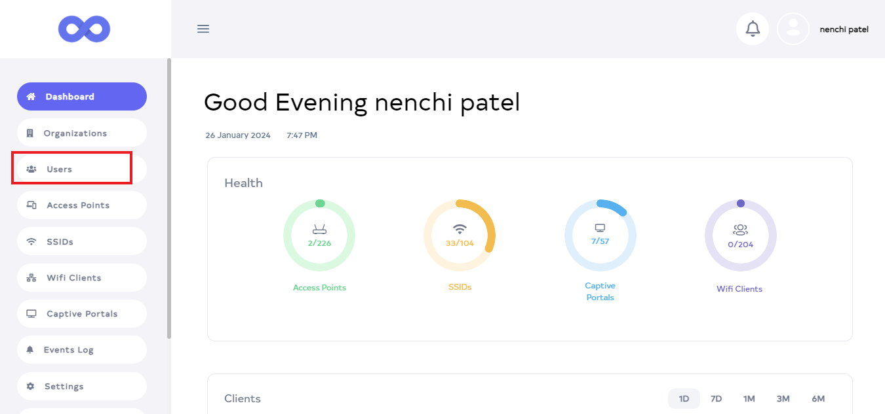

2. You will click on **User**, and there you will see a list of **User**. Click on the **Add New** button.
  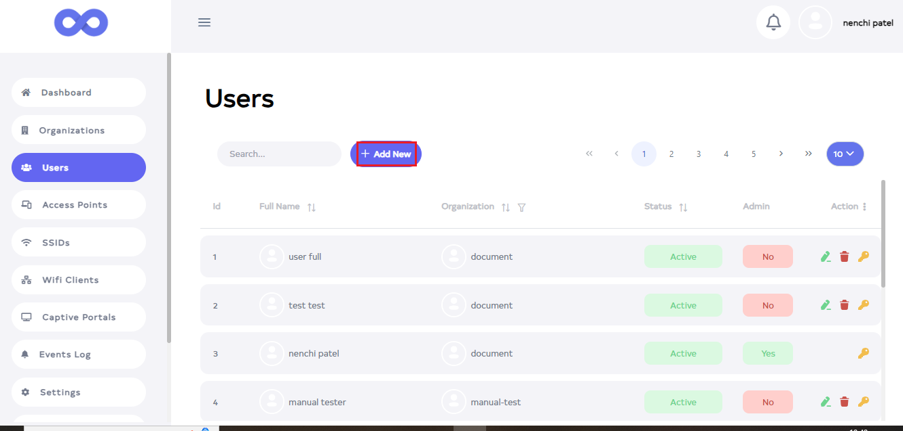

1. After clicking the **Add New** button, a new window will appear. Click on **upload** and set your photo from there. 
   ``` 
    Note:-
    If you want to put a profile picture, it is not mandatory to select it.
   ```
    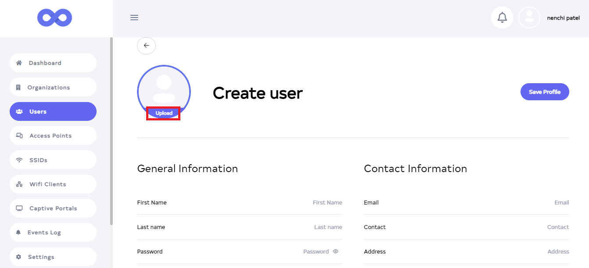

2. Then fill in your details.

   **1.First Name**:- Enter **First Name** for **Ex: nancy**.            
   **2.Last Name**:- Enter **Last Name** for **Ex: Patel**.               
   **3.Password**:- Type the **password** in **Enter Password**.                     
   **4. Select Organization**:- Choose **Select Organization**. For **Ex: Document1**.              
   **5.User role**:- select **User Role**. You will find **(1) Super Admin (2) Organization Admin and (3) User** three roles. Click on **Organization Admin** role.                      
   **6.Status**:-  select User **Status** and click on **Active**.
   **7.Email**:- Enter the **Email ID** you want to use here in Enter **Email ID**. For **Ex: demo@elemprin.com**.
   **8.Contact**:- Enter your **Contact** number.
   **9.Address**:- Enter **Address** for **Ex: Patan**.

  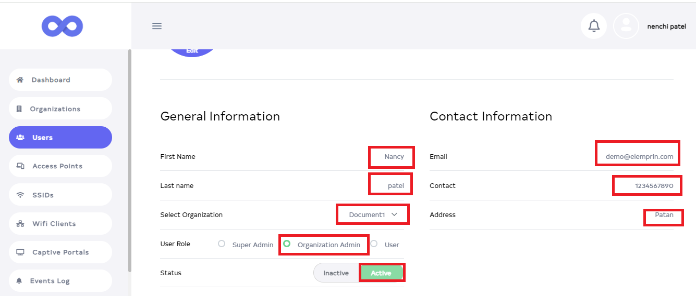

1. There are 3 roles in the user role as done before **1. Super Admin**:- If you select super admin in the user role then yes is written there in admin. It means the admin is the Super Admin user who has all access. **2. User**:- If you select user, it has 2 roles 1. Read-only and Full access.
  **1. Read only**:- If you select Read only then that user can only view. It cannot make any changes.
  **2. Full Access**:- If you select Full Access, then the user can make all the changes with all the access.
   

    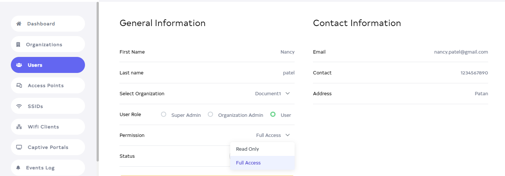


1. Then Click on the located right side **Save profile**.
   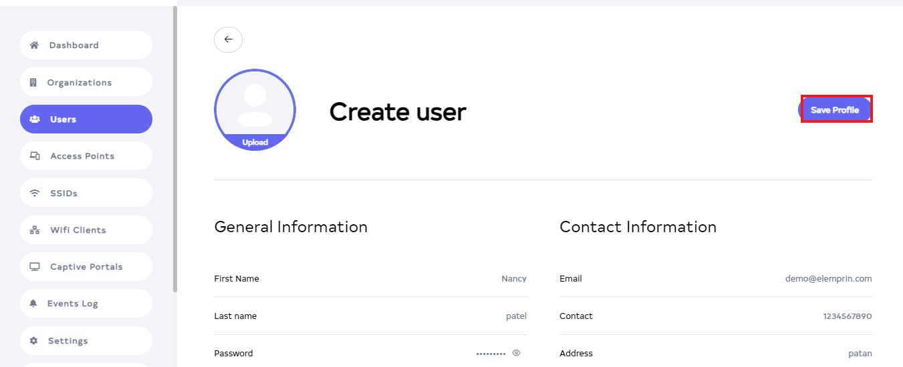

2. As soon as you click on the **Save Profile** button, you will get a message on the screen that the **User is added successfully**.

   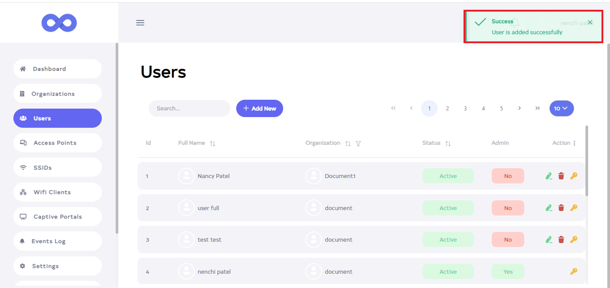


3. After that you can see your **User** there. Since the **Organization admin**, no is written here in admin.
   
   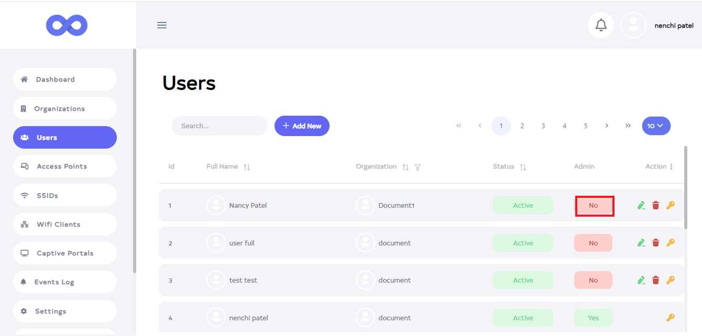


4. Then go to the **Logout** button located on the left side and click on the **Logout** button.
   
   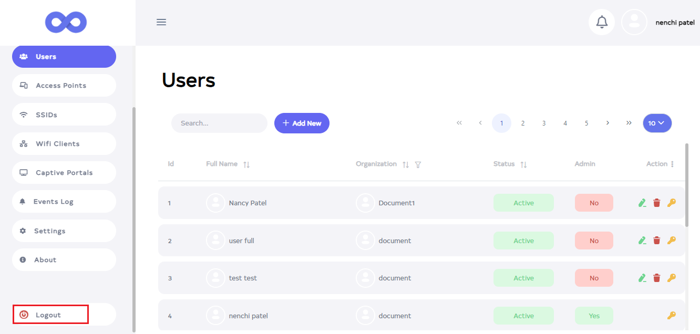

5.   After that fill in all the details(Enter the Email ID and Password of the newly created user in Username and Password) and click on the **Login** button.
   
     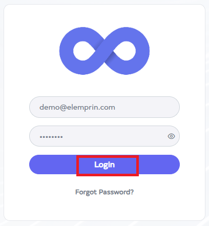

6.  After login. You will notice that the organization admin will not have edit or delete access. You will not get access to create a new organization, you will only get access to add a new user. Since he is an organization admin user, all access will not be available.
    
    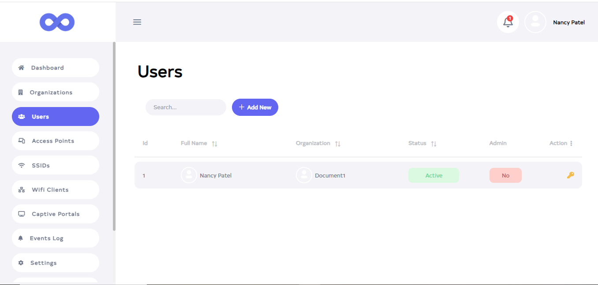
     

### How to edit user
1. Click on the Edit located on the right side of your **User**.
   
  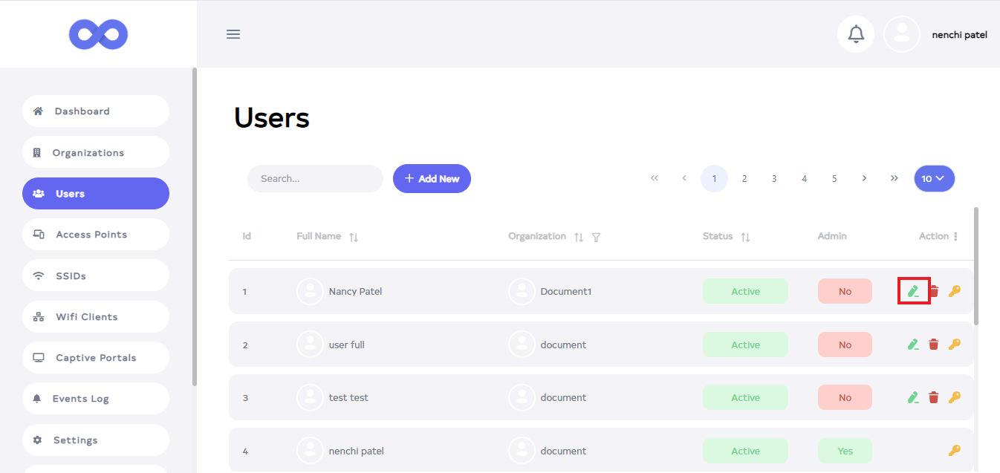

1. After clicking, a new window will open.  From here you can change **Profile Photo, First Name, Last Name, Password, Select Organization, User role, Status, Email, Contact, and Address**.
   
  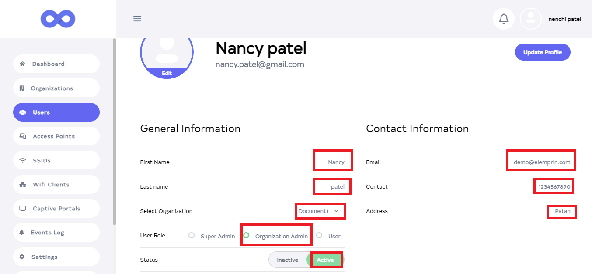

1. Then click on the **Update Profile** button.
   
  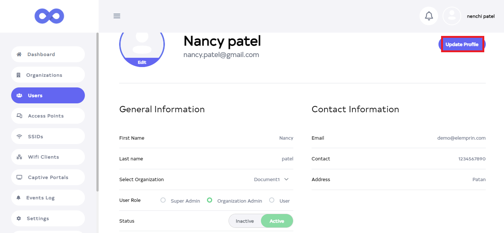


1. After Clicking the **Update Profile** button, you will get a message on the screen that the **User update successfully**.
   
   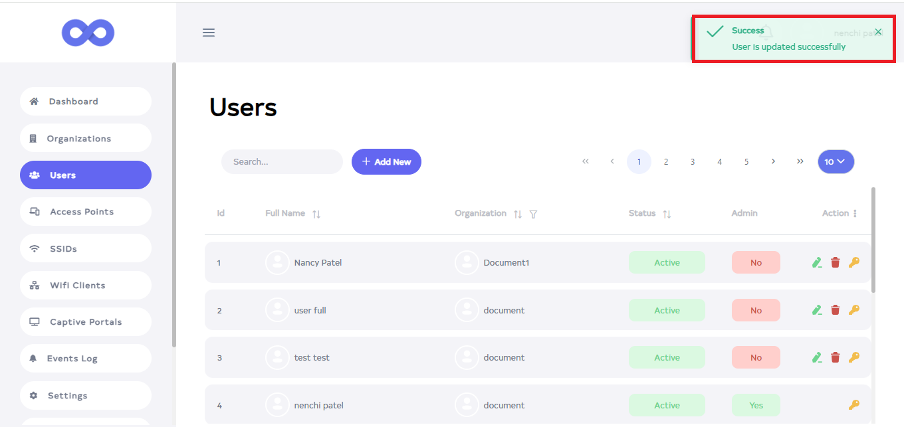


### How to change the password
1. Click on the **Key** Located on the right side of your User.
   
    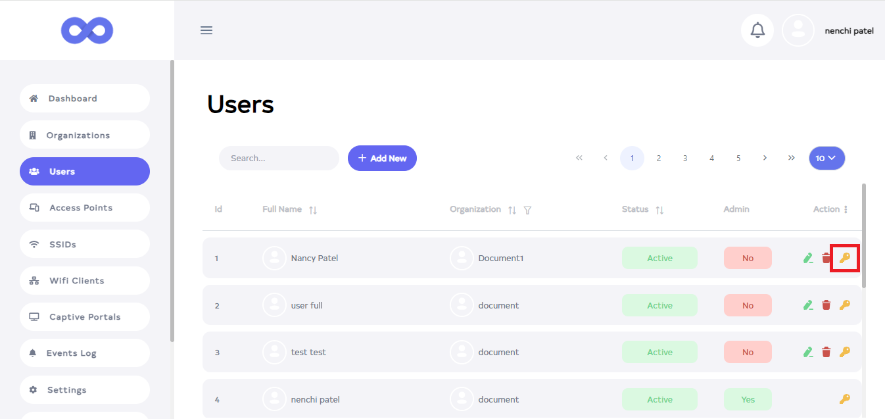

2. After clicking, a new window will open. Fill in your details.
   **1.Password**:- Enter the Password.
   **2. Confirm Password**:- Enter the Confirm Password.

    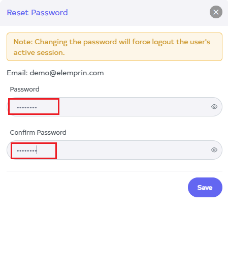

3. Now click on **Save**.
   
    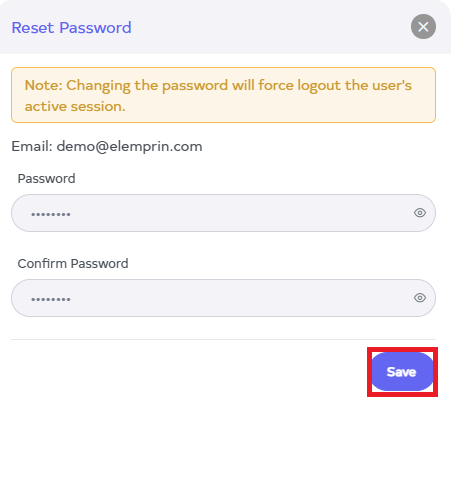

4. After clicking on **Save** you will get the message **User password is updated successfully** on the screen.
   
    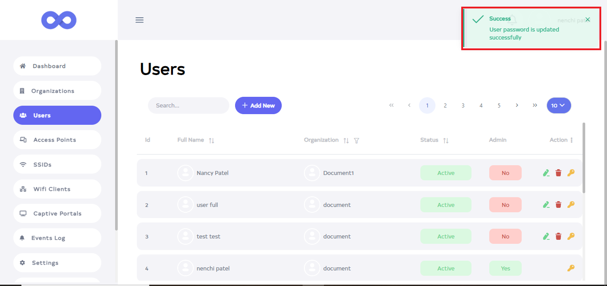

### How to delete User
1. Click on the **delete** located on the right side.
   
   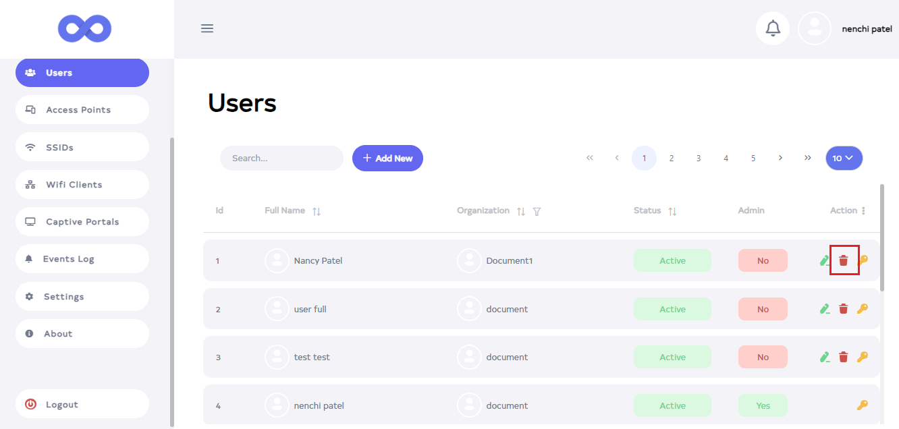

2. After click, a new window will open. There you will get a confirmation message. Click on the **Delete** button.
   
  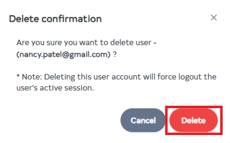


3. As soon as you click on **Delete**, you will get a message on the screen that the **Organization is deleted successfully**.
   
  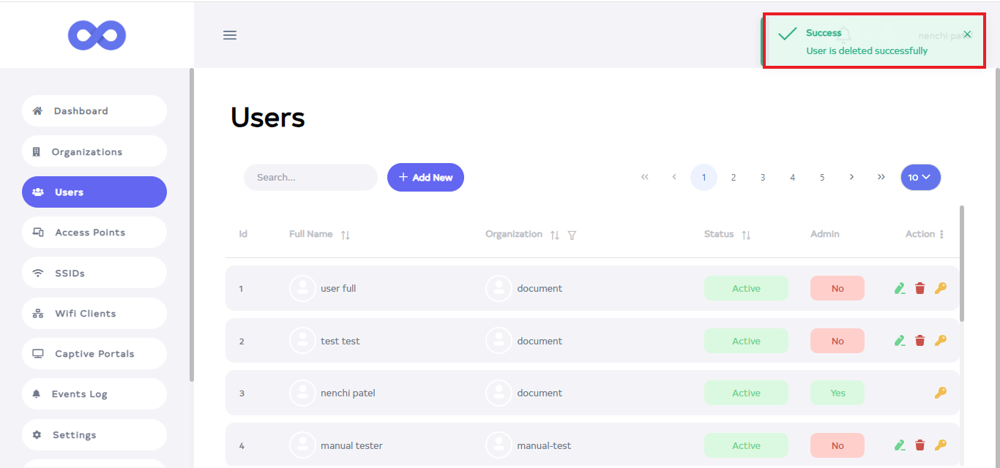
   
