# Organization

## What is an Organization
The organization plays a special role in user management. Without it, it is impossible to create a user, access points, SSIDs, Wifi clients, or captive portals. Organization is only a structural prerequisite that sets the stage for the creation and management of users in the system. which provides a framework for effectively organizing and categorizing users, access points, SSIDs, Wifi clients, or captive portals.

## Why do we need an Organization
Organization is the basic structure for effective management and coordination in the system. The organization plays an important part in user, access points, SSIDs, Wifi clients, or captive portals. A network can be set up with the help of one organization. Provides a framework for systematically organizing and classifying elements. Where  users, access points, SSIDs, Wifi clients, or captive portals. can be efficiently organized. Here organization plays an important role. It is also impossible to create a user, access points, SSIDs, WiFi clients, or captive portals. 

## How to Create an Organization

1. Go to (https://dev.gwcwifi.com/). After filling in the details click on the **Login** button.
   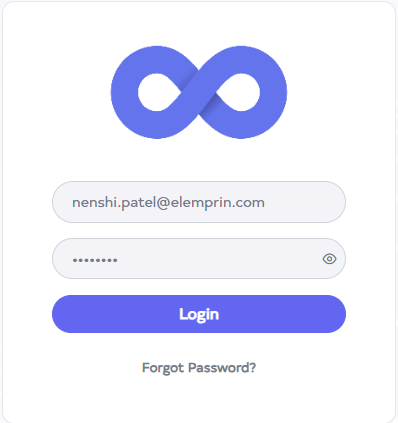

2. When you **Login**, you will reach the dashboard by default. Then click on the **Organization** menu located on the left side.
   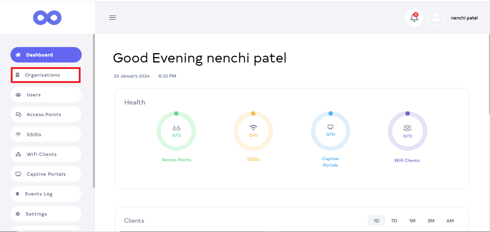

3. You will click on **Organization**, there you will see a list of **Organization**. And click on the **Add New** button.
   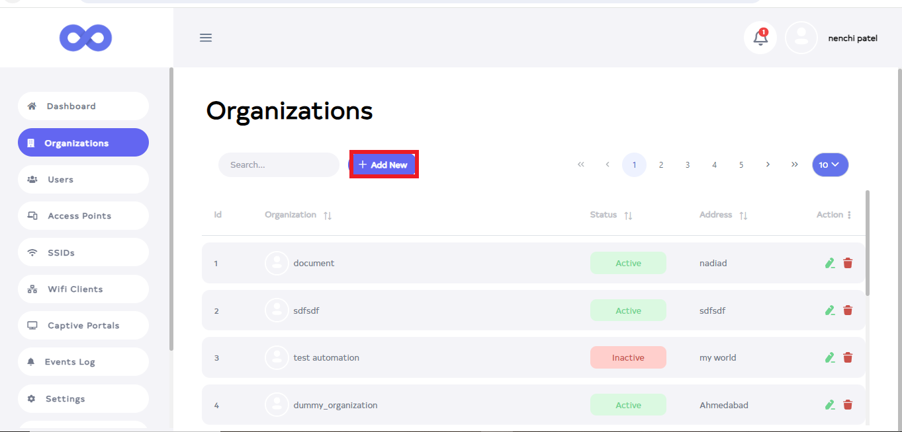

4. After clicking the **Add New** button, a new window will appear. Click on **upload** and set your photo from there. 
   ``` 
    Note:-
    If you want to put a profile picture, it is not mandatory to select it.
   ```
    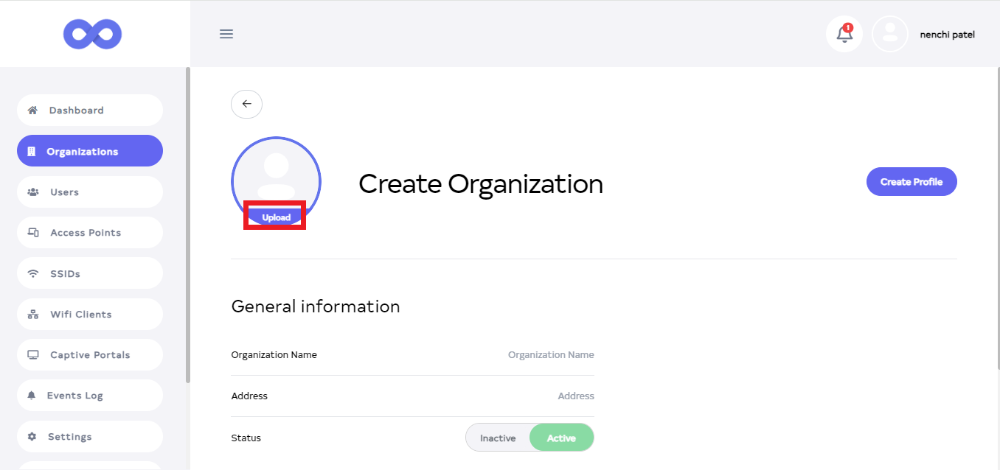

5. Then fill in your details.

   **1.Organization Name**:- Type **Organization Name** for **ex:- Document1**.            
   **2.Address**:- Type **Address** for **ex:- patan**.                
   **3.Status**:- Select **Status** for **ex:- Active**.                     
   **4.Email**:- Type your **Email** for **ex:- demo@elemprin.com**.              
   **5.Contact**:- Type your **Contact**                        
   **6. Find your work**:- Type **Find your work** for **ex:-Technical writer**.           

    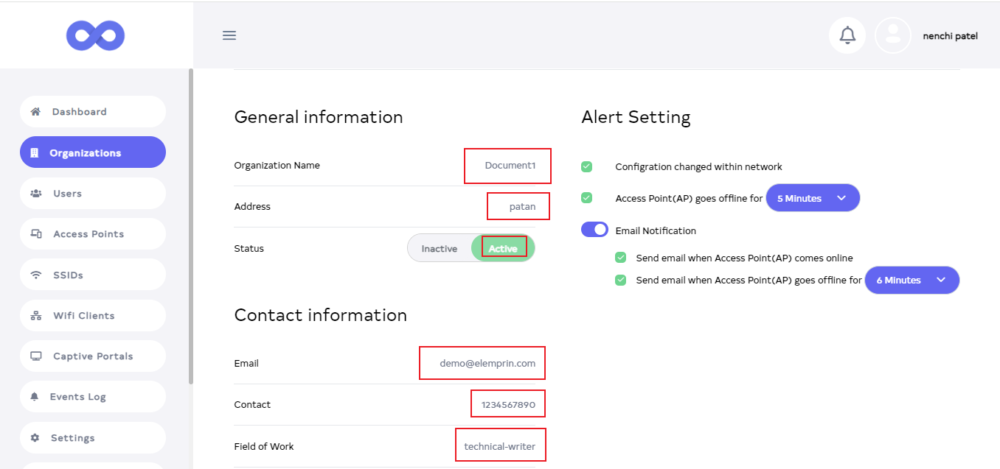


6. Then Click on the located right side **Create profile**.

     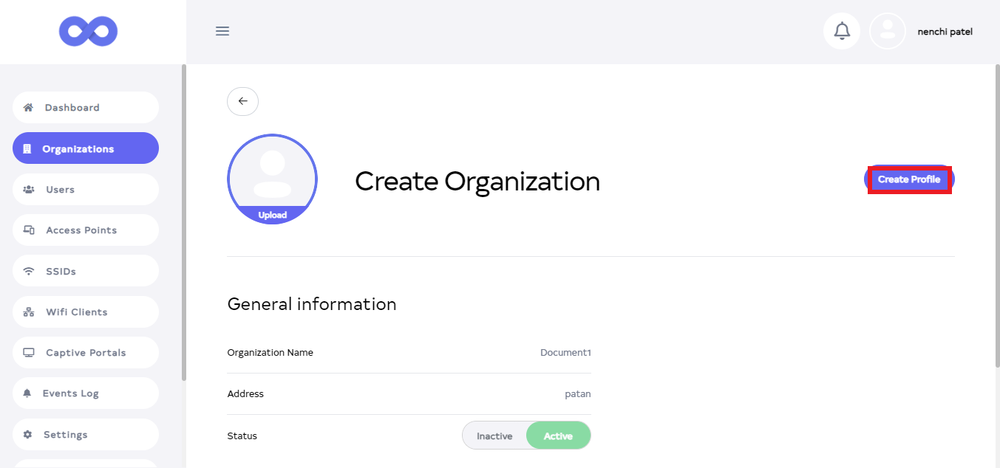

7. As soon as you click on the **Create Profile** button, you will get a message on the screen that the **Organization is added successfully**.

    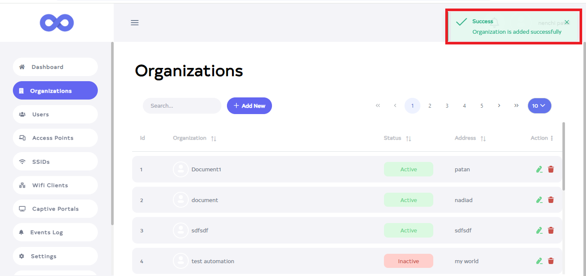

8. After that you can see your **Organization** there.

    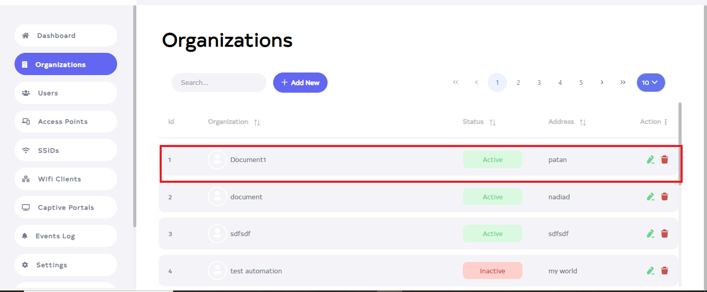

### How to edit Organization

1. Go to the **oraganization** want to edit.
2. Click on the **Edit** located on the right side of your organization.
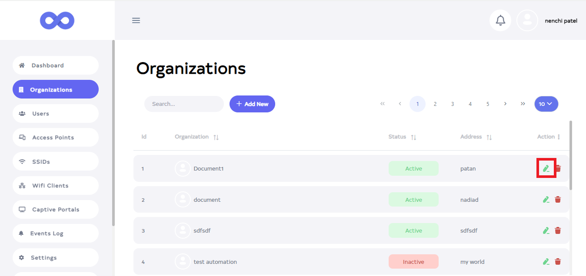

1. After clicking, a new window will open.
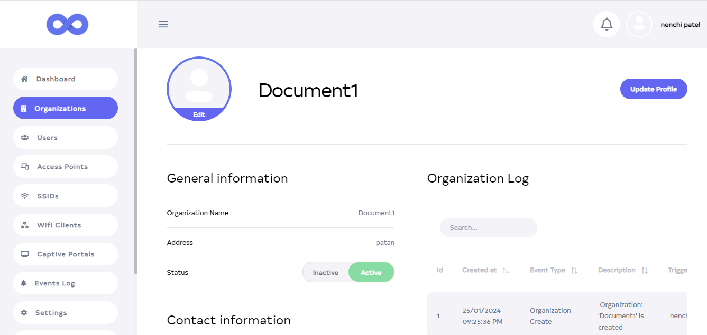

1. From here you can change **Profile Photo, Organization Name, Address, Status, Email, Contact, and Your Work**.
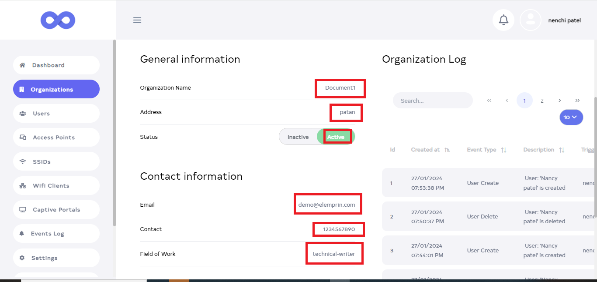

1. Located on the right, the **Organization Log** shows the changes made to the organization.
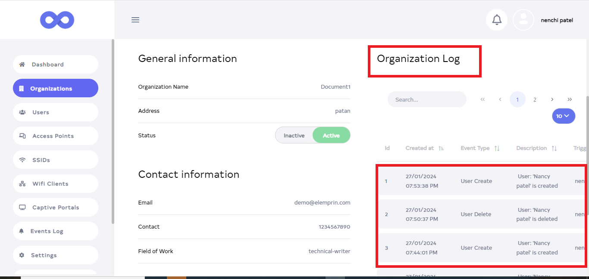

1. Then click on the **Update Profile** button.
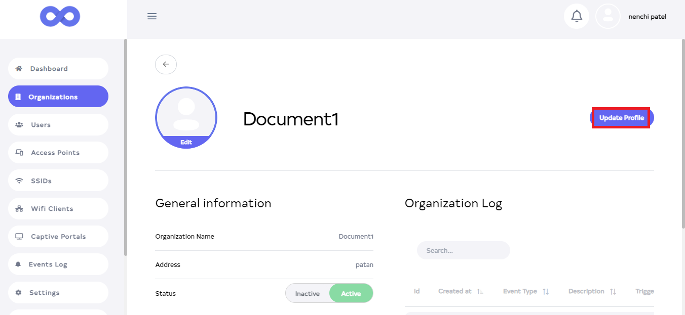


1. After Clicking the **Update Profile** button, you will get a message on the screen that the **Organization update successfully**.
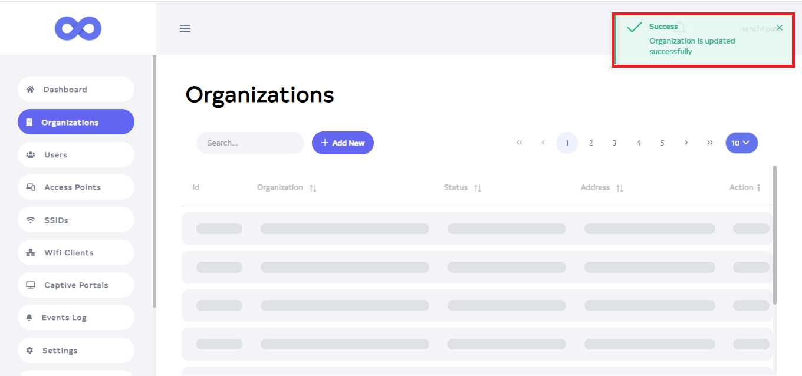

### How to delete Organization

1. Click on the delete located on the right side.

   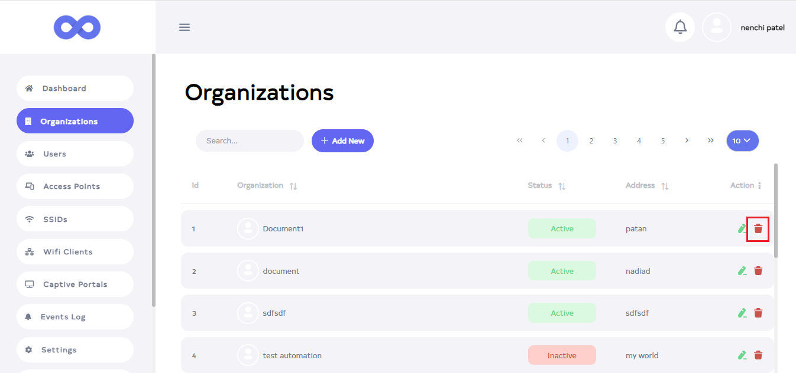

2. After click, a new window will open. There you will get a confirmation message. Click on the **Delete** button.

   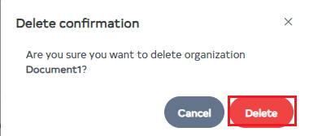

3. As soon as you click on **Delete**, you will get a message on the screen that the **Organization is deleted successfully**.

   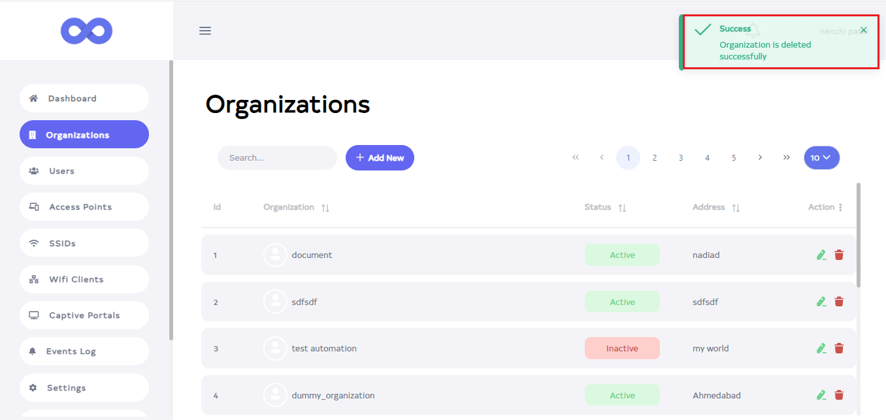

