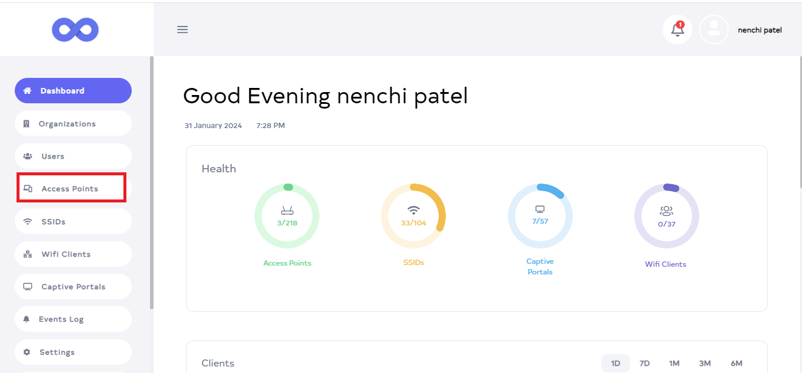
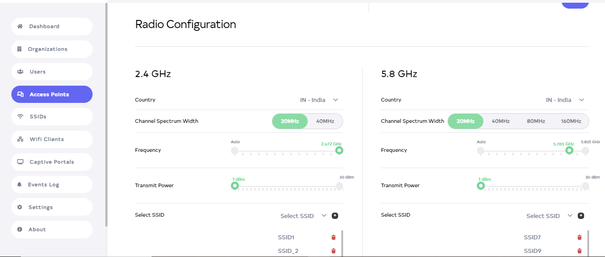
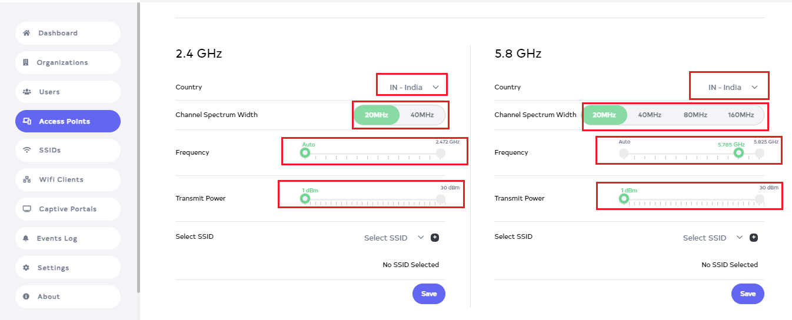
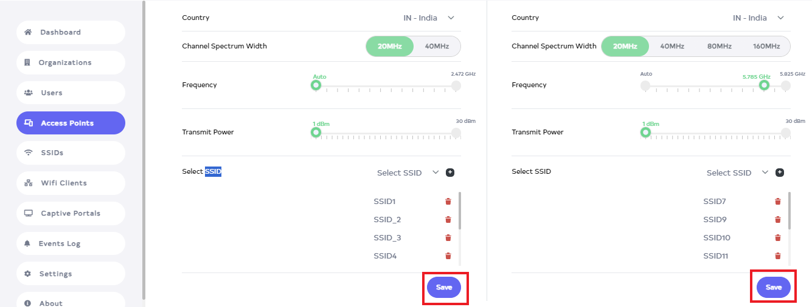

# Radio Configuration
## What is a Radio Configuration
Radio configuration in the context of an Access Point (AP) refers to the settings and parameters that control the operation of the AP's radio interfaces. These configurations are essential for optimizing the performance, coverage, and reliability of the wireless network.

**1. Country**: Country has to be chosen in radio configuration. Choose the country you want. The code for the country is given. For **Ex: IND is for India**.   
**2. Channel Spectrum Width**:- change channel spectrum width. In the context of wireless networking, channel spectrum width refers to the range of 
frequencies allocated to a communication channel, particularly in an access point. The width of the spectrum determines how much bandwidth is available 
for data transmission. In WiFi networks, channel spectrum width is often expressed in terms of MHz.        
 - **There are 2 primary channel spectrum width options commonly used in wifi networks**.      
      **(1) 20 MHz channel width**:- This is the standard channel width and provides a relatively narrow frequency range for data transmission. In this 
                                     configuration, the access point uses a 20MHz wide channel to send and receive data.     
      **(2) 40 MHz channel width**:- This option doubles the channel width to 40 MHz thereby increasing the data transfer rate. However, using a wider 
                                     channel may result in higher chances of interference. Especially in the 2.4 GHz band, where there are fewer non-overlapping 
                                     channels.

**3. Frequency**: Access Points operate in the 2.4 GHz and/or 5 GHz frequency bands. The selection of frequency bands impacts factors like signal penetration, coverage range, and susceptibility to interference. Some APs can operate simultaneously in both frequency bands.     
 - **There are 2 primary frequency bands used for wifi**.      
     **(1) 2.4 GHz Band**:- This is the older and denser frequency band. It is carried in multiple channels and devices can communicate on these channels 
                            although due to its widespread use, it may experience interference from other devices such as cordless phones, microwaves, and 
                            neighboring wifi networks.        
     **(2) 5 GHz band**:- This band offers more channels and tends to be less crowded as compared to the 2.4 GHz band. It allows for higher data rates and is 
                          generally preferred in environments where data transfer is required.       

**4. Transmit Power**: Transmit power controls the strength of the wireless signal transmitted by the AP. Adjusting transmit power can affect coverage range, signal strength, and network performance. Higher transmit power may increase coverage but could also lead to increased interference and power consumption.     

## Why do we need Radio Configuration
Radio configuration is essential for optimizing the performance, coverage, and reliability of wireless networks. Proper configuration ensures compliance with regulatory standards, minimizes interference, and maximizes data transfer rates, ultimately enhancing the overall user experience.

## How to configure Radio Configuration
1. Click on the **Access Point** menu located on the left side.

   

2. Go to the device you want to **Radio Configuration**.
3. Click on the **Edit** located on the right side of your access point.

   

4. After clicking, a new window will open. If you scroll a little there, you will get **Radio Configuration**. **Radio Configuration** is of 2 types **(1) 2.4 GHz and (2) 5.8 GHz**.

   

5. Then you are given the **Country, Channel Spectrum Width, Frequency, and Transmit Power** in **2.4 GHz and 5.8 GHz**. From there you can both add and change to GHz. 

   

6. Then click on the **Save** button.

   

7. As soon as you click on the Save button, you will get a message on the screen that **Device configuration is updated successfully**.

   

