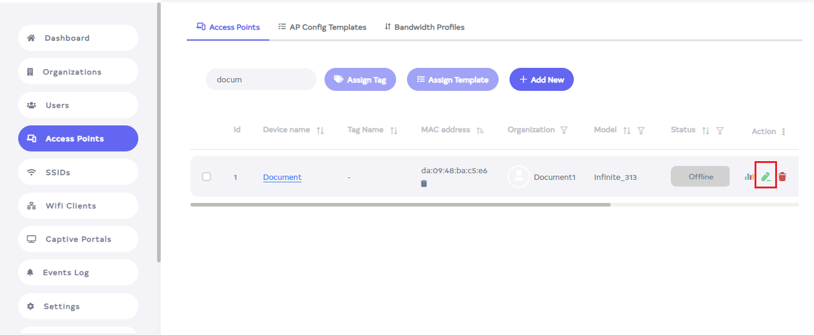
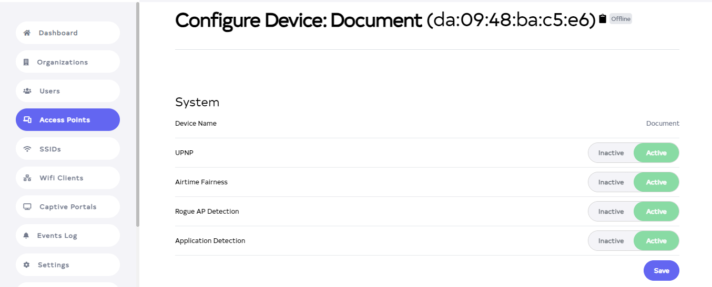
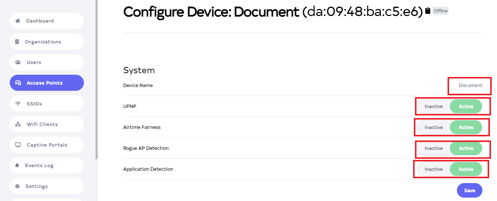
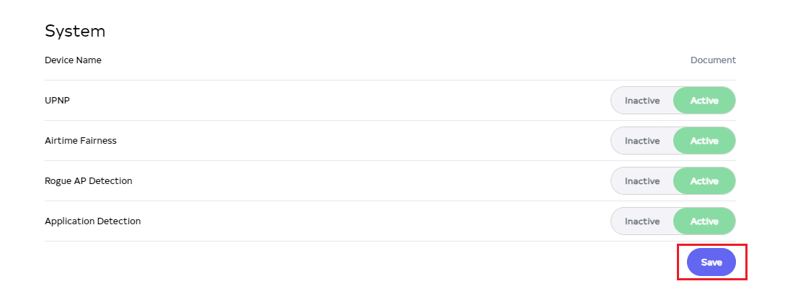
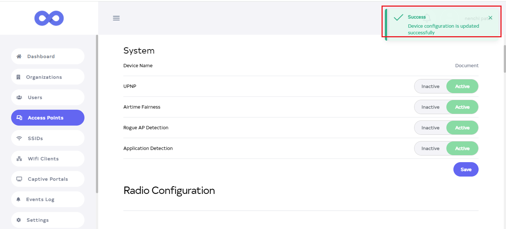

# System
## What is a System
A system, in a general sense, refers to a set of interconnected or interdependent components working together to achieve a common goal or purpose. It can encompass various elements such as hardware, software, processes, people, and data, all functioning in an organized manner to perform specific tasks efficiently.     
**1. Device Name**: This refers to the unique identifier assigned to a particular device within a network. Each device connected to a network typically has a device name to differentiate it from others.              
**2. UPNP (Universal Plug and Play)**: UPnP is a set of networking protocols that allows devices within a network to discover each other and establish communication for sharing data, services, and control without requiring manual configuration by a user or administrator.       
**3. Airtime Fairness**: Airtime fairness is a feature commonly found in wireless networking systems, particularly in Wi-Fi routers and access points. It aims to ensure that each connected device receives an equal share of the available airtime, thereby improving overall network performance and fairness in accessing the network resources.        
**4. Rogue AP Detection**: Rogue AP (Access Point) detection is a security feature implemented in network systems to identify unauthorized or malicious access points within the network. It helps administrators detect and mitigate potential security risks posed by rogue access points, which could be used for unauthorized access or attacks.     
**5. Application Detection**: An Application Detection is a type of security system that monitors network traffic to identify and categorize the applications or services being used within the network. It helps administrators gain visibility into the types of applications being accessed, enforce usage policies, and detect any unauthorized or suspicious activities.
## Why do we need a System
The aforementioned system is crucial for effective network management and security. Device naming ensures clear identification, simplifying troubleshooting and management tasks. UPnP streamlines device discovery and communication, enhancing network interoperability. Airtime fairness optimizes network performance by allocating resources equitably among connected devices. Rogue AP detection safeguards against unauthorized access points, reducing the risk of security breaches. Application detection enables monitoring and enforcement of usage policies, ensuring network resources are utilized efficiently and securely. Together, these components bolster network efficiency, reliability, and security, essential for modern digital operations and safeguarding against potential threats and disruptions.
## How to configure System
1. Go to the device you want to **System**.
2. Click on the **Edit** located on the right side of your **access point**.

   

3. After clicking on the **edit** button, a new window will open. There you can see the **System**.

   

4. In the system you will find the **Device name, UPNP, Airtime Fairness, Rogue AP Detection, Application Detection**. In which you can make changes from here. You can also change the system name and enable and disable **UPNP, Airtime Fairness, Rogue AP Detection, and Application Detection**.

   

5. Click on **Save** button.

   

6. As soon as you click on the **Save** button, you will get a message on the screen that the **Device configuration is updated successfully**.

   
